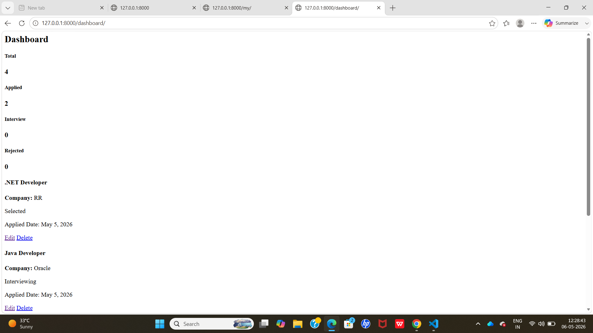
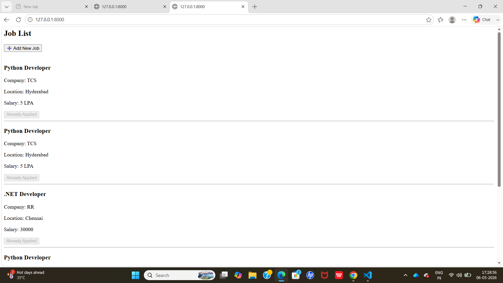
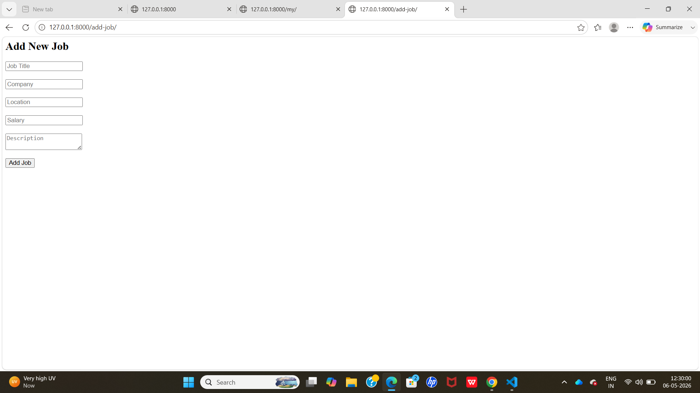
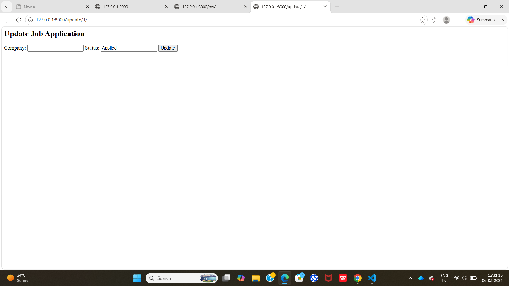

# 🚀 HireTrack - Django Job Tracking System

## 📌 Overview
HireTrack is a web-based job tracking system built using Django. It helps users manage job applications efficiently.

---

## ✨ Features
- User authentication system
- Add and track job applications
- Status tracking (Applied / Pending / Selected / Rejected)
- Clean dashboard UI

---

## 🛠️ Tech Stack
- Python 🐍
- Django 🌐
- HTML, CSS 🎨
- SQLite 🗄️

---

## 🚀 How to Run Project
```bash
python manage.py runserver

## 📸 Screenshots







